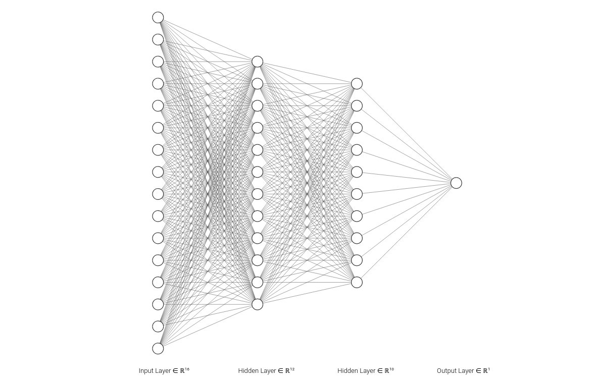
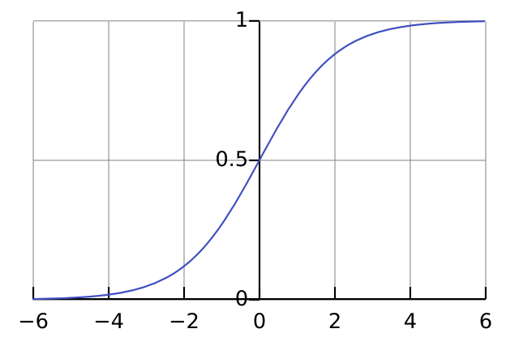
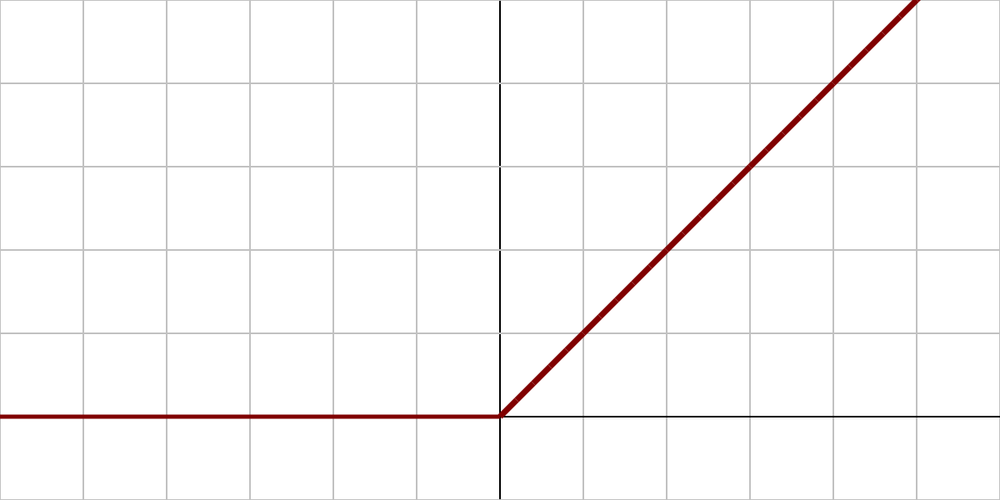
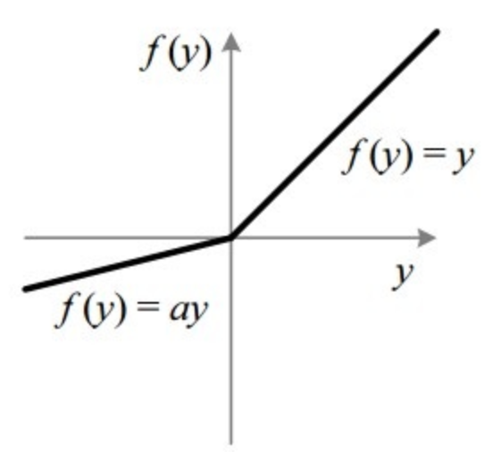
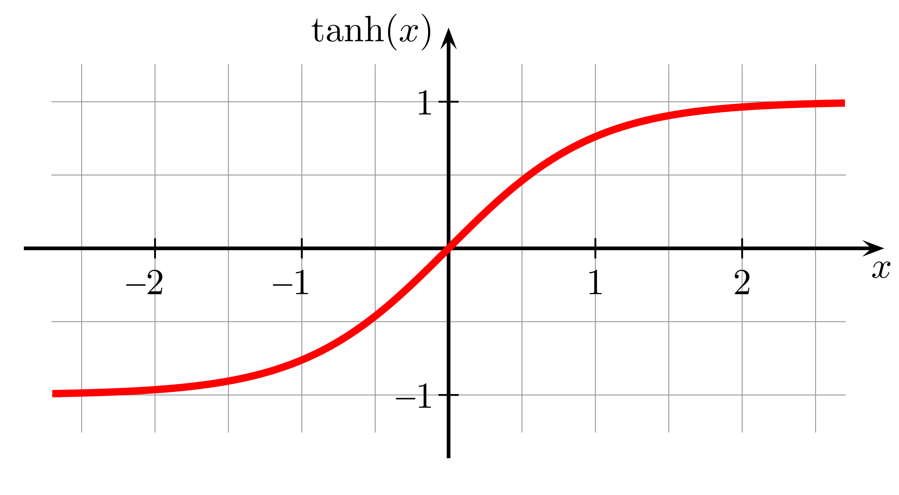
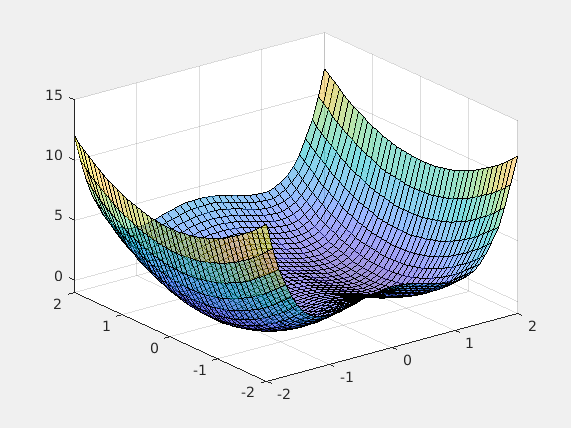
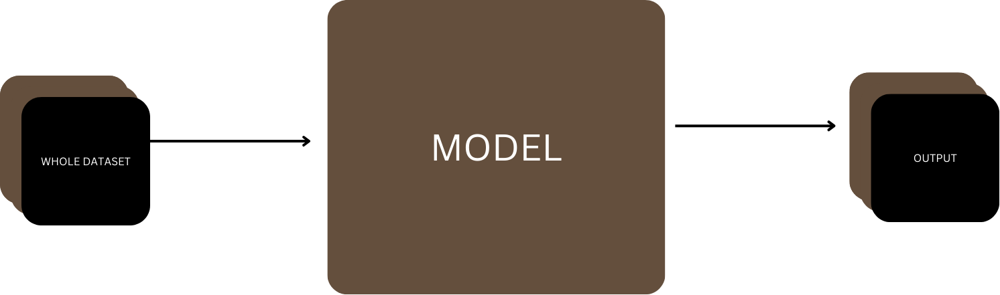
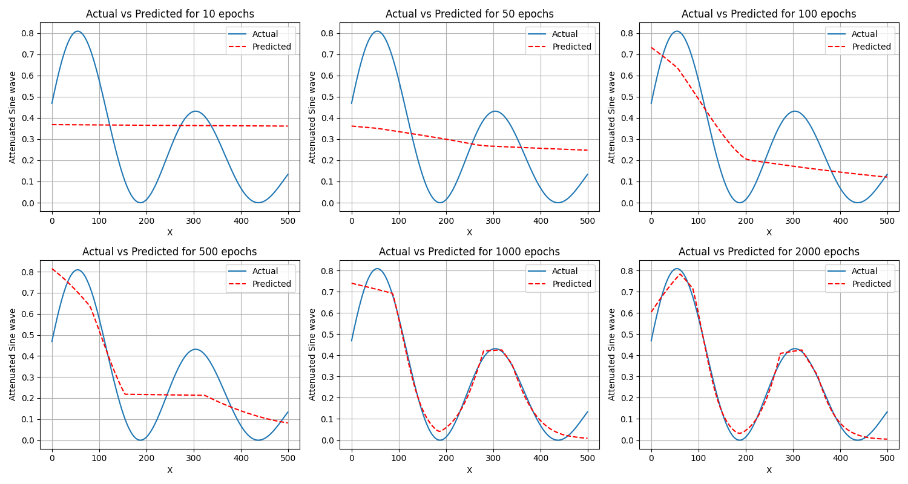

# Deep Neural Network From Scratch
 
- [Theory on Forward Pass](#theory-on-forward-pass)
  - [Forward Pass Code Implementation](#forward-pass-code-implementation)
- [Activation Functions](#activation-functions)
  - [Sigmoid](#sigmoid)
  - [ReLU](#relu)
  - [Leaky ReLU](#leaky-relu)
  - [Tanh](#tanh)
- [Cost Functions](#cost-functions)
  - [Cross-Entropy Loss](#cross-entropy-loss)
  - [Code implementation](#code-implementation)
  - [Mean Squared Error (MSE)](#mean-squared-error-mse)
  - [Code Implementation for MSE](#code-implementation-for-mse)
  - [Mean Absolute Error (MAE)](#mean-absolute-error-mae)
  - [Code Implementation for MAE](#code-implementation-for-mae)
- [Theory on Backpropagation](#theory-on-backpropagation)
  - [Gradient Calculation](#gradient-calculation)
  - [Vectorized Approach for $m$ Data Points](#vectorized-approach-for-m-data-points)
  - [Backpropagation Code Implementation](#backpropagation-code-implementation)
- [Parameter Update](#parameter-update)
  - [Gradient Descent Algorithm](#gradient-descent-algorithm)
  - [Parameter Update Code Implementation](#parameter-update-code-implementation)
  - [Code Implementation](#code-implementation)
- [Prediction](#prediction)
  - [Code Implementation](#code-implementation)
- [Batch Generator](#batch-generator)
  - [Code Implementation](#code-implementation)
- [Test](#test)


<a href="https://drive.google.com/file/d/1Sin3vv_8qJhF11KOV8ADclBCzbY8zHvB/view?usp=drive_link" target="_blank">YOU CAN READ THE THEORY NOTES FROM HERE</a>

A neural network is a computational model inspired by the way biological neural networks in the human brain process information. It consists of layers of interconnected neurons that work together to recognize patterns and solve complex problems. Neural networks are used in a wide range of applications including image and speech recognition, natural language processing, and game playing.

---



## Theory on Forward Pass

The forward pass involves calculating the output of the neural network by passing the input through each layer sequentially. The output of one layer becomes the input to the next layer.

For a layer $l$, the linear part of the forward pass is given by:

$$
Z^{[l]} = W^{[l]} A^{[l-1]} + b^{[l]}
$$

where $W^{[l]}$ and $b^{[l]}$ are the weights and biases of layer $l$, and $A^{[l-1]}$ is the activation from the previous layer.

The activation part of the forward pass involves applying an activation function $g$:

$$
A^{[l]} = g(Z^{[l]})
$$

> During a forward pass in a neural network, each layer computes its output based on the input it receives from the previous layer or directly from the input data. To facilitate the subsequent calculation of gradients during backpropagation, it is crucial to store certain intermediate values, often referred to as the "cache". These cached values typically include the inputs and outputs of each layer, which are necessary for computing gradients efficiently.

So the `linear_cache` and `activation_cache` are for storing each layers output and use them during `backward propagation`.

### Forward Pass Code Implementation

```python
def linear_forward(A, W, b):
    Z = np.dot(W, A) + b
    cache = (A, W, b)
    return Z, cache

def linear_activation_forward(A_prev, W, b, activation):
    if activation == "sigmoid":
        Z, linear_cache = linear_forward(A_prev, W, b)
        A, activation_cache = sigmoid(Z)
    elif activation == "relu":
        Z, linear_cache = linear_forward(A_prev, W, b)
        A, activation_cache = relu(Z)
    elif activation == "leaky_relu":
        Z, linear_cache = linear_forward(A_prev, W, b)
        A, activation_cache = leaky_relu(Z)
    elif activation == "tanh":
        Z, linear_cache = linear_forward(A_prev, W, b)
        A, activation_cache = tanh(Z)
    elif activation == "linear":
        Z, linear_cache = linear_forward(A_prev, W, b)
        A, activation_cache = Z, Z
    else:
        raise ValueError("Invalid activation function. Supported activations: 'sigmoid', 'relu', 'leaky_relu', 'tanh'")

    cache = (linear_cache, activation_cache)
    return A, cache

def L_model_forward(X, parameters, hidden_layer_activation, output_layer_activation):
    caches = []
    A = X
    L = len(parameters) // 2

    for l in range(1, L):
        A_prev = A
        A, cache = linear_activation_forward(A_prev, parameters['W' + str(l)], parameters['b' + str(l)], activation=hidden_layer_activation)
        caches.append(cache)

    AL, cache = linear_activation_forward(A, parameters['W' + str(L)], parameters['b' + str(L)], activation=output_layer_activation)
    caches.append(cache)

    return AL, caches
```

---


## Activation Functions

### Sigmoid

The sigmoid function is defined as:

$$
\sigma(z) = \frac{1}{1 + e^{-z}}
$$




The sigmoid function outputs a value between 0 and 1, making it useful for binary classification tasks. However, it can suffer from the vanishing gradient problem, where gradients become very small during backpropagation, slowing down the learning process.
 

Let's denote the sigmoid function as $\sigma(z) = S(z)$. The derivative of $S(z)$ with respect to $z$ is $S'(z)$.

Now, let's differentiate $S(z)$ with respect to $z$. Using the quotient rule, where $\frac{d}{dz} \left( \frac{u}{v} \right) = \frac{u'v - uv'}{v^2}$, let $u = 1$ and $v = 1 + e^{-z}$.

We need the derivatives of $u$ and $v$:

$$ u' = 0 $$
$$ v' = \frac{d}{dz}(1 + e^{-z}) = -e^{-z} $$

Applying the quotient rule:

$$ S'(z) = \frac{0 \cdot (1 + e^{-z}) - 1 \cdot (-e^{-z})}{(1 + e^{-z})^2} $$
$$ S'(z) = \frac{e^{-z}}{(1 + e^{-z})^2} $$


We have $S(z) = \frac{1}{1 + e^{-z}}$, and therefore $1 - S(z) = \frac{e^{-z}}{1 + e^{-z}}$.

Using this, we can rewrite $S'(z)$:

$$ S'(z) = S(z) \cdot (1 - S(z)) $$

Thus, the derivative of the sigmoid function is:

$$ \boxed{S'(z) = \sigma(z) (1 - \sigma(z))} $$


**Code Implementation:**

```python
def sigmoid(z):
    s = 1 / (1 + np.exp(-z))
    cache = z
    return s, cache

def sigmoid_backward(dA, activation_cache):
    Z = activation_cache
    s = 1 / (1 + np.exp(-Z))
    dZ = dA * s * (1 - s)
    return dZ
```

### ReLU

The Rectified Linear Unit (ReLU) function is defined as:

$$
\text{ReLU}(z) = \max(0, z)
$$

ReLU is widely used due to its simplicity and effectiveness. It helps mitigate the vanishing gradient problem by allowing gradients to flow when the input is positive.




**Code Implementation:**

```python
def relu(z):
    r = np.maximum(0, z)
    cache = z
    return r, cache

def relu_backward(dA, activation_cache):
    Z = activation_cache
    dZ = np.array(dA, copy=True)
    dZ[Z <= 0] = 0
    return dZ
```

### Leaky ReLU

Leaky ReLU is a variation of ReLU that allows a small, non-zero gradient when the input is negative:

$$
\text{Leaky ReLU}(z) = \max(\alpha z, z)
$$

where $\alpha$ is a small constant.



**Code Implementation:**

```python
def leaky_relu(z, alpha=0.01):
    r = np.maximum(alpha * z, z)
    cache = z
    return r, cache

def leaky_relu_backward(dA, activation_cache, alpha=0.01):
    Z = activation_cache
    dZ = np.array(dA, copy=True)
    dZ[Z <= 0] = alpha
    return dZ
```

### Tanh

The hyperbolic tangent (tanh) function is defined as:

$$
\tanh(z) = \frac{e^z - e^{-z}}{e^z + e^{-z}}
$$

The tanh function outputs values between -1 and 1, making it useful for zero-centered data.



To find the derivative of the hyperbolic tangent function, $\tanh(z)$, we start with its definition:

$$ \tanh(z) = \frac{e^z - e^{-z}}{e^z + e^{-z}} $$

Let's denote the hyperbolic tangent function as $\tanh(z) = T(z)$. The derivative of $T(z)$ with respect to $z$ is $T'(z)$.

First, rewrite $T(z)$:

$$ T(z) = \frac{e^z - e^{-z}}{e^z + e^{-z}} $$

Now, differentiate $T(z)$ with respect to $z$. Using the quotient rule, where $\frac{d}{dz} \left( \frac{u}{v} \right) = \frac{u'v - uv'}{v^2}$, let $u = e^z - e^{-z}$ and $v = e^z + e^{-z}$.

We need the derivatives of $u$ and $v$:

$$ u' = e^z + e^{-z} $$
$$ v' = e^z - e^{-z} $$

Applying the quotient rule:

$$ T'(z) = \frac{(e^z + e^{-z})(e^z + e^{-z}) - (e^z - e^{-z})(e^z - e^{-z})}{(e^z + e^{-z})^2} $$
$$ T'(z) = \frac{(e^z + e^{-z})^2 - (e^z - e^{-z})^2}{(e^z + e^{-z})^2} $$

Expand $(e^z + e^{-z})^2$ and $(e^z - e^{-z})^2$:

$$ (e^z + e^{-z})^2 = e^{2z} + 2 + e^{-2z} $$
$$ (e^z - e^{-z})^2 = e^{2z} - 2 + e^{-2z} $$

Substitute these into the derivative expression:

$$ T'(z) = \frac{(e^{2z} + 2 + e^{-2z}) - (e^{2z} - 2 + e^{-2z})}{(e^z + e^{-z})^2} $$
$$ T'(z) = \frac{4}{(e^z + e^{-z})^2} $$

Therefore, the derivative of the hyperbolic tangent function is:

$$ \boxed{T'(z) = \frac{4}{(e^z + e^{-z})^2}} $$

This can also be expressed in terms of $\tanh(z)$:

$$ \boxed{T'(z) = 1 - \tanh^2(z)} $$

Both forms represent the derivative of the hyperbolic tangent function with respect to $z$.


**Code Implementation:**

```python
def tanh(z):
    t = np.tanh(z)
    cache = z
    return t, cache

def tanh_backward(dA, activation_cache):
    Z = activation_cache
    t = np.tanh(Z)
    dZ = dA * (1 - t ** 2)
    return dZ
```

---


## Cost Functions

In a neural network, the cost function (or loss function) measures how well the network's predictions match the actual target values during training. It quantifies the error between predicted outputs and expected outputs. The goal during training is to minimize this cost function, which helps the neural network learn optimal weights and biases that enable accurate predictions. Common cost functions include Mean Squared Error (MSE) for regression tasks and Cross-Entropy Loss for classification tasks.


### Cross-Entropy Loss

The cross-entropy loss is used for binary classification problems. It measures the performance of a classification model whose output is a probability value between 0 and 1.

$$
\text{Cross-Entropy Loss} = -\frac{1}{m} \sum_{i=1}^{m} \left[ y_i \log(\hat{y}_i) + (1 - y_i) \log(1 - \hat{y}_i) \right]
$$


 
The binary cross entropy loss function for a single prediction is :

$$ L(AL, Y) = - (Y \log(AL) + (1 - Y) \log(1 - AL)) $$

Where:
- $AL$ is the predicted output.
- $Y$ is the true label (either 0 or 1).

Now, to find $\frac{\partial L}{\partial AL}$:

We Comput the Derivate and it is given as :

   $$ \frac{\partial L}{\partial AL} = - \left( \frac{Y}{AL} - \frac{1 - Y}{1 - AL} \right) $$
 
### Code implementation

```python
dAL = - (np.divide(Y, AL) - np.divide(1 - Y, 1 - AL))
```

```python
 cost = -(1/m) * np.sum(Y * np.log(AL) + (1-Y) * np.log(1-AL))
```

where $dAL$ represents $\frac{\partial L}{\partial AL}$ in the context of our code.

### Mean Squared Error (MSE)

The Mean Squared Error (MSE) is used for regression tasks. It measures the average squared difference between the actual and predicted values.

The MSE for $m$ data points is defined as:

$$
\text{MSE} = \frac{1}{m} \sum_{i=1}^{m} (y_i - \hat{y}_i)^2
$$

For the loss function:

$$
L(AL, Y) = \frac{1}{m} \sum_{i=1}^{m} (Y_i - AL_i)^2
$$

To find the gradient $\frac{\partial L}{\partial AL_i}$:

$$
\frac{\partial L}{\partial AL_i} = \frac{\partial}{\partial AL_i} \left( \frac{1}{m} \sum_{i=1}^{m} (Y_i - AL_i)^2 \right)
$$

Applying the derivative:

$$
\frac{\partial L}{\partial AL_i} = \frac{2}{m} \sum_{i=1}^{m} (AL_i - Y_i)
$$

So,

$$
\frac{\partial L}{\partial AL} = \frac{2}{m} (AL - Y)
$$

### Code Implementation for MSE

```python
# Gradient of the loss with respect to AL for MSE
dAL = (2/m) * (AL - Y)

# Mean Squared Error cost function
cost = (1/m) * np.sum((AL - Y) ** 2)
```

### Mean Absolute Error (MAE)

The Mean Absolute Error (MAE) measures the average absolute difference between the actual and predicted values.

The MAE for $m$ data points is defined as:

$$
\text{MAE} = \frac{1}{m} \sum_{i=1}^{m} |y_i - \hat{y}_i|
$$

For the loss function:

$$
L(AL, Y) = \frac{1}{m} \sum_{i=1}^{m} |Y_i - AL_i|
$$

To find the gradient $\frac{\partial L}{\partial AL_i}$:

The absolute function $|Y_i - AL_i|$ has different derivatives depending on the sign of $Y_i - AL_i$:

$$
\frac{\partial L}{\partial AL_i} = \frac{\partial}{\partial AL_i} \left( \frac{1}{m} \sum_{i=1}^{m} |Y_i - AL_i| \right)
$$

So, the derivative for each $i$:

$$
\frac{\partial L}{\partial AL_i} = \begin{cases}
\frac{1}{m} (-1) & \text{if } AL_i < Y_i \\
\frac{1}{m} (1) & \text{if } AL_i > Y_i
\end{cases}
$$

### Code Implementation for MAE

```python
# Gradient of the loss with respect to AL for MAE
dAL = (1/m) * np.where(AL > Y, 1, -1)

# Mean Absolute Error cost function
cost = (1/m) * np.sum(np.abs(AL - Y))
```

In these implementations:
- `dAL` represents the gradient of the loss with respect to `AL` for $m$ data points.
- `cost` represents the calculated cost using the respective loss function for $m$ data points.

## Theory on Backpropagation

Backpropagation is the process of calculating the gradients of the loss function with respect to each parameter in the neural network. These gradients are then used to update the parameters in order to minimize the loss.

### Gradient Calculation

Let's consider a neural network with $L$ layers. For the $l$-th layer, we have the following equations:

$$ Z^{[l]} = W^{[l]} A^{[l-1]} + b^{[l]} $$

After this linear transformation, an activation function $g(x)$ is applied to get the activation output $A^{[l]}$:

$$ A^{[l]} = g(Z^{[l]}) $$

For the final layer, $A^{[L]}$ represents the predicted output of the network. To update the weights using gradient descent, we need to compute the gradients of the loss function with respect to the weights. We use the chain rule for this purpose. 

$$ \frac{\partial L_{\text{fn}}}{\partial W} = \frac{\partial L_{\text{fn}}}{\partial A} \cdot \frac{\partial A}{\partial Z} \cdot \frac{\partial Z}{\partial W} $$

For coding, we use the following Notation,

$$ dZ^{[l]} = \frac{\partial L_{\text{fn}}}{\partial Z^{[l]}} = \frac{\partial L_{\text{fn}}}{\partial A^{[l]}} \cdot \frac{\partial A^{[l]}}{\partial Z^{[l]}} $$

Given that:

$$ A^{[l]} = g(Z^{[l]}) $$

Using the chain rule, we can write:

$$ dZ^{[l]} = dA^{[l]} \cdot g'(Z^{[l]}) $$

where $g'$ is the derivative of the activation function.

From the linear transformation:

$$ Z^{[l]} = W^{[l]} A^{[l-1]} + b^{[l]} $$

We can derive the partial derivatives:

$$ \frac{\partial Z^{[l]}}{\partial W^{[l]}} = A^{[l-1]} $$
$$ \frac{\partial Z^{[l]}}{\partial b^{[l]}} = 1 $$

Now once we know $dZ^{[l]}$, we can compute the following gradients:

$$ dW^{[l]} = \frac{\partial L_{\text{fn}}}{\partial W^{[l]}} = dZ^{[l]} \cdot (A^{[l-1]})^T $$
$$ db^{[l]} = \frac{\partial L_{\text{fn}}}{\partial b^{[l]}} = dZ^{[l]} $$
$$ dA^{[l-1]} = \frac{\partial L_{\text{fn}}}{\partial A^{[l-1]}} = (W^{[l]})^T \cdot dZ^{[l]} $$

### Vectorized Approach for $m$ Data Points

When dealing with multiple data points (a mini-batch of size $m$), we can vectorize the computations.  

Gradient Calculations are done as :

$$
dZ^{[l]} = \frac{\partial L}{\partial A^{[l]}} \cdot g'(Z^{[l]})
$$

$$
dW^{[l]} = \frac{1}{m} dZ^{[l]} \cdot (A^{[l-1]})^T
$$
$$
db^{[l]} = \frac{1}{m} \sum_{i=1}^{m} dZ^{[l]}_i
$$
$$
dA^{[l-1]} = (W^{[l]})^T \cdot dZ^{[l]}
$$

### Backpropagation Code Implementation

```python
def linear_backward(dZ, cache):
    A_prev, W, b = cache
    m = A_prev.shape[1]

    dW = 1/m * np.dot(dZ, A_prev.T)
    db = 1/m * np.sum(dZ, axis=1, keepdims=True)
    dA_prev = np.dot(W.T, dZ)

    return dA_prev, dW, db

def linear_activation_backward(dA, cache, activation):
    linear_cache, activation_cache = cache

    if activation == "sigmoid":
        dZ = sigmoid_backward(dA, activation_cache)
    elif activation == "relu":
        dZ = relu_backward(dA, activation_cache)
    elif activation == "leaky_relu":
        dZ = leaky_relu_backward(dA, activation_cache)
    elif activation == "tanh":
        dZ = tanh_backward(dA, activation_cache)
    elif activation == "linear":
        dZ = dA
    else:
        raise ValueError("Invalid activation function. Supported activations: 'sigmoid', 'relu', 'leaky_relu', 'tanh'")

    dA_prev, dW, db = linear_backward(dZ, linear_cache)
    return dA_prev, dW, db

def L_model_backward(AL, Y, caches, hidden_layer_activation, output_layer_activation):
    grads = {}
    L = len(caches)
    m = AL.shape[1]
    Y = Y.reshape(AL.shape)

    dAL = - (np.divide(Y, AL) - np.divide(1 - Y, 1 - AL))

    current_cache = caches[L-1]
    grads["dA" + str(L-1)], grads["dW" + str(L)], grads["db" + str(L)] = linear_activation_backward(dAL, current_cache, output_layer_activation)

    for l in reversed(range(L-1)):
        current_cache = caches[l]
        dA_prev_temp, dW_temp, db_temp = linear_activation_backward(grads["dA" + str(l + 1)], current_cache, hidden_layer_activation)
        grads["dA" + str(l)] = dA_prev_temp
        grads["dW" + str(l + 1)] = dW_temp
        grads["db" + str(l + 1)] = db_temp

    return grads
```

---

## Parameter Update

The parameters of the neural network are updated using the gradients calculated during backpropagation. In this code we have used gradient descent optimizer for the optimization.

### Gradient Descent Algorithm

Gradient descent is an optimization algorithm used to minimize the loss function. The basic idea is to adjust the parameters in the direction of the negative gradient of the loss function with respect to the parameters.



For a parameter $\theta$:

$$
\theta = \theta - \alpha \frac{\partial L}{\partial \theta}
$$

where $\alpha$ is the learning rate.

### Parameter Update Code Implementation

```python
def update_parameters(parameters, grads, learning_rate):
    L = len(parameters) // 2

    for l in range(L):
        parameters["W" + str(l+1)] -= learning_rate * grads["dW" + str(l+1)]
        parameters["b" + str(l+1)] -= learning_rate * grads["db" + str(l+1)]

    return parameters
```

---
 ## Training the Model 

For training , I have used a batch generator that splits the data into many small batches and trains each batch for `n` epochs. The costs are calculated for each epochs and displayed later throug `plot_epoch` function.

### Code Implementation 

```python
def train(self, X, Y, learning_rate=0.0075, num_epochs=100, batch_size=64, shuffle=True, epoch_verbose=10, print_cost=False):
    self.costs = []

    for i in range(num_epochs):
        minibatches = batch_generator(X, Y, batch_size=batch_size, shuffle=shuffle)
        minibatch_num = len(minibatches)
        cost = 0
        for minibatch in minibatches:
            (minibatch_X, minibatch_Y) = minibatch

            AL, caches = self.L_model_forward(minibatch_X)
            cost += self.compute_cost(AL, minibatch_Y, loss_type=self.loss_function)
            grads = self.L_model_backward(AL, minibatch_Y, caches)
            self.parameters = self.update_parameters(grads, learning_rate)
        cost = cost/minibatch_num
        if print_cost and i % epoch_verbose == 0:
            print(f"Cost after iteration {i}: {cost}")

        self.costs.append(cost)
```
 
- **Epochs**: The training process is divided into several epochs. An epoch refers to one complete pass through the entire training dataset.
- **Mini-batches**: Instead of updating the parameters after every single training example, we divide the training dataset into smaller subsets called mini-batches. This reduces the variance of the parameter updates and can lead to more stable convergence.
- **Cost Calculation**: For each mini-batch, we calculate the cost and accumulate it. At the end of each epoch, the average cost over all mini-batches is recorded.
- **Parameter Update**: The gradients are computed using backpropagation and the parameters are updated using gradient descent.

## Prediction

### Code Implementation 

```python
def predict(self, X): 
    A = X
    L = len(self.parameters) // 2

    for l in range(1, L):
        A_prev = A
        A, cache = self.linear_activation_forward(A_prev, self.parameters['W' + str(l)], self.parameters['b' + str(l)], activation=self.hidden_layer_activation)
    AL, cache = self.linear_activation_forward(A, self.parameters['W' + str(L)], self.parameters['b' + str(L)], activation=self.output_layer_activation)

    return AL
```
 
- **Forward Propagation**: The `predict` function performs a forward pass through the entire network using the learned parameters. It uses the `linear_activation_forward` function to compute the activations at each layer.
- **Output**: The final output, `AL`, is the prediction of the network for the input `X`.

## Batch Generator 

We have followed vectorized approach of training , i.e whole data goes into the forward pass and update the weights. But due to memory limitation, the whole data may not be able to fit in the `GPU` , thus we split the data into mini-batches and then perform forward pass and then update the weights.



### Code Implementation 

```python
def batch_generator(X, Y, batch_size, shuffle=True):
    m = X.shape[1]
    mini_batches = []

    if shuffle:
        permutation = list(np.random.permutation(m))
        shuffled_X = X[:, permutation]
        shuffled_Y = Y[:, permutation].reshape((1, m))
    else:
        shuffled_X = X
        shuffled_Y = Y.reshape((1, m))

    num_complete_minibatches = m // batch_size
    for k in range(num_complete_minibatches):
        mini_batch_X = shuffled_X[:, k * batch_size : (k + 1) * batch_size]
        mini_batch_Y = shuffled_Y[:, k * batch_size : (k + 1) * batch_size]
        mini_batches.append((mini_batch_X, mini_batch_Y))

    if m % batch_size != 0:
        mini_batch_X = shuffled_X[:, num_complete_minibatches * batch_size :]
        mini_batch_Y = shuffled_Y[:, num_complete_minibatches * batch_size :]
        mini_batches.append((mini_batch_X, mini_batch_Y))

    return mini_batches
```
 
  
## Test 

Lets fit the neural network on some regression task.

```bash
python train.py --batch_size 8 --learning_rate 0.1 --num_epochs 3000
```


